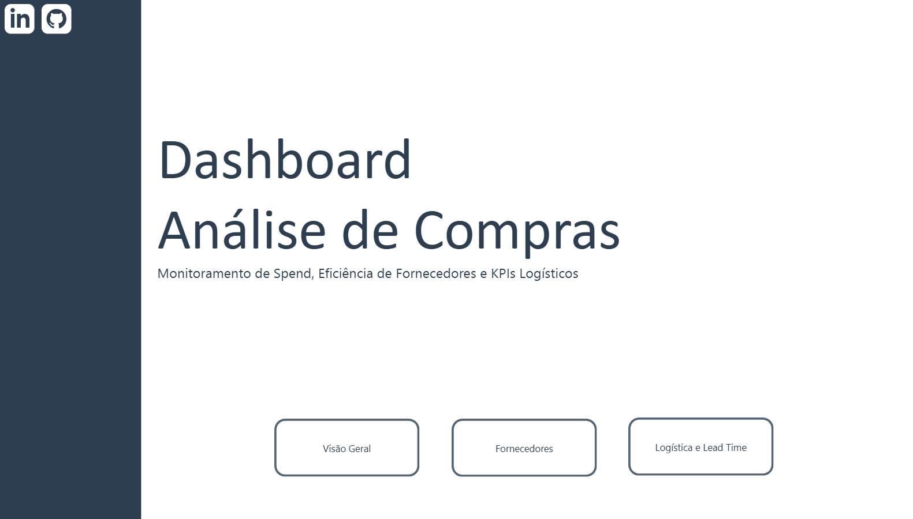
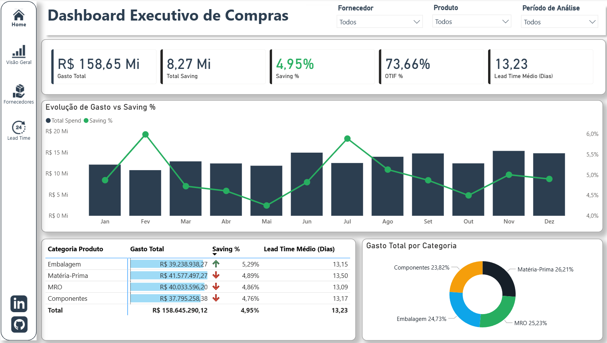
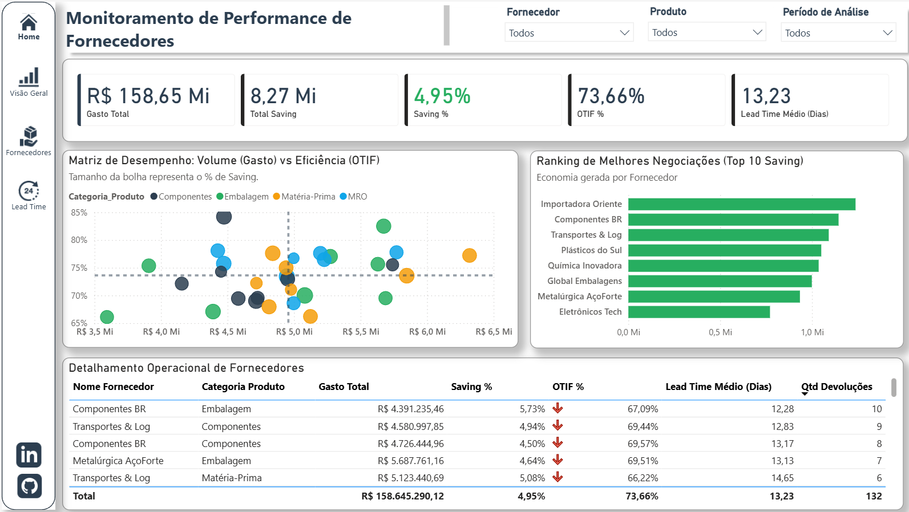
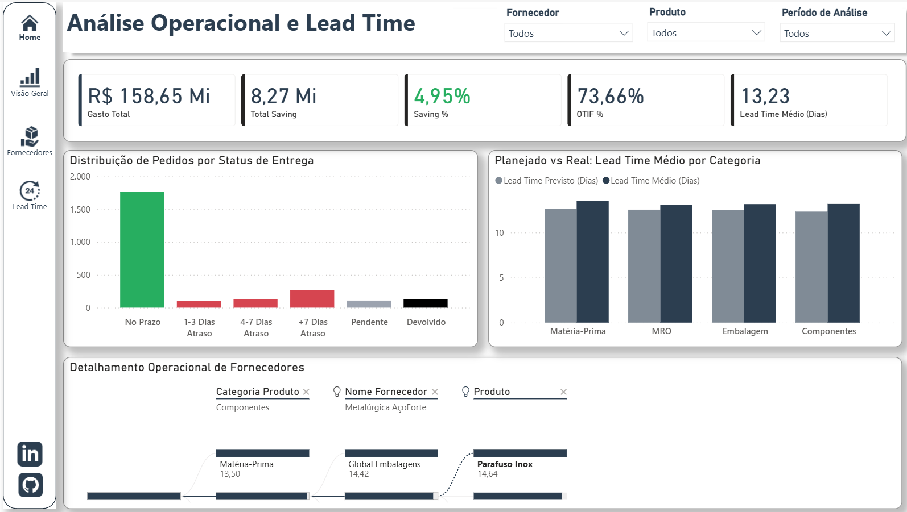
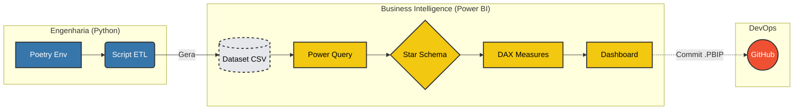
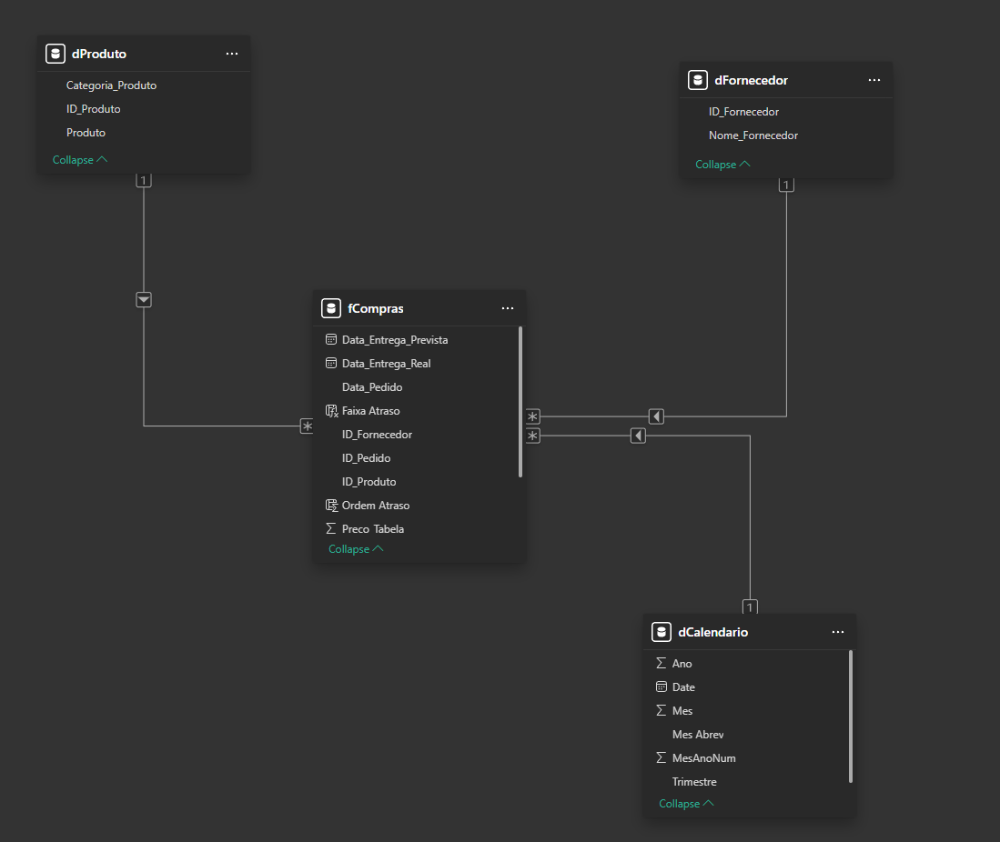

# 🛒 Dashboard Estratégico de Compras (Procurement)


---

## 🖼️ Visão Geral do Dashboard

  
*Capa do Projeto: Interface de navegação estilo App com foco em UX.*

  
*Visão Geral Compras: Interface de Análise geral de compras*

  
*Fornecedores: Interface de Monitoramento e performance de fornecedores*

  
*Lead Time: Interface de Análise operacional de lead time*

### 🔗 Links
- [**Acesse o Dashboard Interativo**](https://app.powerbi.com/view?r=eyJrIjoiNzhmYzVmZTktZjJlYS00OThhLThhOGMtYThmNWY2ZjllMzMzIiwidCI6IjY5N2VmY2I3LTZjMTktNDVkMS04ZDc1LWZkMDE3NjYzNmIyYyJ9)

---

## 💼 Sobre o Projeto
Este projeto simula um cenário real de uma indústria de manufatura que precisa monitorar a eficiência de seu departamento de compras. O objetivo foi construir uma solução *End-to-End*, desde a geração dos dados brutos via script Python até a análise estratégica no Power BI.

O dashboard responde a perguntas críticas de negócio, como:
* O volume de **Saving** (economia) está alinhado com as metas?
* Quais fornecedores possuem o maior risco de entrega (**OTIF** baixo)?
* Onde estão os gargalos logísticos que impactam o **Lead Time**?

---

## 🏗️ Arquitetura Técnica



---

## 🛠️ Tecnologias Utilizadas
* **Python (Pandas/Numpy):** Script para geração de massa de dados complexa (2.500+ registros) com regras de negócio probabilísticas (sazonalidade, atrasos aleatórios e status de entrega).
* **Poetry:** Gerenciamento de dependências e ambiente virtual.
* **Power BI:**
    * **Power Query (M):** ETL, tratamento de tipagem e criação dinâmica da dimensão calendário.
    * **Modelagem:** Star Schema (Fato/Dimensão) para alta performance.
    * **DAX Avançado:** Cálculo de medidas como Saving %, OTIF (On Time In Full), Share of Wallet e Segmentação de Atrasos.
    * **Design:** UI/UX corporativo focado em clareza, uso de Storytelling e navegação por drill-through.
* **PBIP (Power BI Project):** Integração nativa com Git para versionamento do relatório.
    
    *Modelo Dimensional: Modelagem Dimensional Power BI*  

### 1. Extração e Carga (Python ETL)
Script desenvolvido para automatizar a geração de dados e salvar em csv.

Arquivo: ```scripts/extract_load.py```

### 2. Inteligência de Negócio (DAX)
Abaixo estão os códigos completos das medidas desenvolvidas para as análises avançadas no Power BI.

**Gasto Total**
````
Total Spend = 
SUMX(
    fCompras, 
    fCompras[Qtd] * fCompras[Preco_Unitario_Negociado]
)
````
**Total Saving**
````
Total Saving Value = 
SUMX(
    fCompras, 
    (fCompras[Preco_Tabela] - fCompras[Preco_Unitario_Negociado]) * fCompras[Qtd]
)
````
**% Saving**
````
Saving % = 
DIVIDE(
    [Total Saving Value],
    SUMX(fCompras, fCompras[Preco_Tabela] * fCompras[Qtd]),
    0
)
````
**Lead Time**
````
Lead Time Médio (Dias) = 
CALCULATE(
    AVERAGEX(
        fCompras,
        DATEDIFF(fCompras[Data_Pedido], fCompras[Data_Entrega_Real], DAY)
    ),
    fCompras[Status_Entrega] <> "Pendente",
    NOT(ISBLANK(fCompras[Data_Entrega_Real]))
)
````
**Lead Time Previsto**
````
Lead Time Previsto (Dias) = 
AVERAGEX(
    fCompras,
    DATEDIFF(fCompras[Data_Pedido], fCompras[Data_Entrega_Prevista], DAY)
)
````
**% OTIF**
````
OTIF % = 
VAR PedidosNoPrazo = 
    CALCULATE(
        COUNTROWS(fCompras),
        fCompras[Status_Entrega] = "Entregue", // In Full (não devolvido)
        fCompras[Data_Entrega_Real] <= fCompras[Data_Entrega_Prevista] // On Time
    )
VAR TotalPedidosFinalizados = 
    CALCULATE(
        COUNTROWS(fCompras),
        fCompras[Status_Entrega] <> "Pendente" // Ignora o que ainda não chegou
    )
RETURN
    DIVIDE(PedidosNoPrazo, TotalPedidosFinalizados, 0)
// OTIF (On Time In Full)
````
**Quantidade de Devoluções**
````
Qtd Devoluções = 
CALCULATE(
    COUNTROWS(fCompras),
    fCompras[Status_Entrega] = "Devolvido"
)
````
**Quantidade de Pedidos**
````
Contagem de Pedidos = COUNTROWS(fCompras)
````

---

## 📊 Estrutura do Relatório

### 1. Visão Executiva (Overview)
Foco em KPIs financeiros. Monitoramento do **Gasto Total** (R$ 158M) e **Saving** (4,95%), com análise de tendência mensal para identificar desvios orçamentários.

### 2. Performance de Fornecedores
Matriz de decisão utilizando Scatter Plot (Dispersão) para cruzar **Volume de Compras x Eficiência de Entrega**. Identificação automática de parceiros estratégicos vs. fornecedores de risco.

### 3. Análise Operacional e Lead Time
Diagnóstico logístico. Utilização de Histograma para distribuição de atrasos e **Decomposition Tree** (Árvore Hierárquica) para Root Cause Analysis (Análise de Causa Raiz) dos gargalos de entrega.

## 🚀 Como Executar o Projeto

### Pré-requisitos
* Python 3.10+
* Poetry
* Power BI Desktop

### Passos
1.  **Clone o repositório:**
    ```bash
    git clone https://github.com/LucianoAMagalhaes/BI_Compras.git
    cd BI_Compras
    ```

2.  **Instale as dependências e gere os dados:**
    ```bash
    poetry install
    poetry run python scripts/extract_load.py
    ```
    *Isso criará o arquivo `data/compras_dataset.csv`.*

3.  **Abra o Dashboard:**
    * Navegue até a pasta `power_bi/`.
    * Abra o arquivo `Compras.pbip`.
    * No Power Query, altere para o diretório local onde o CSV foi gerado.

---